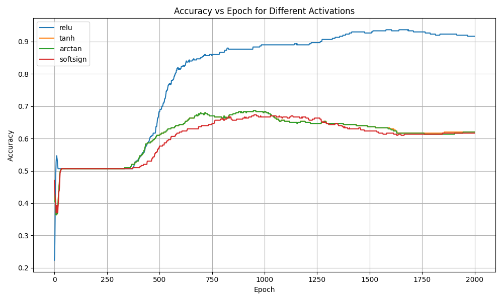
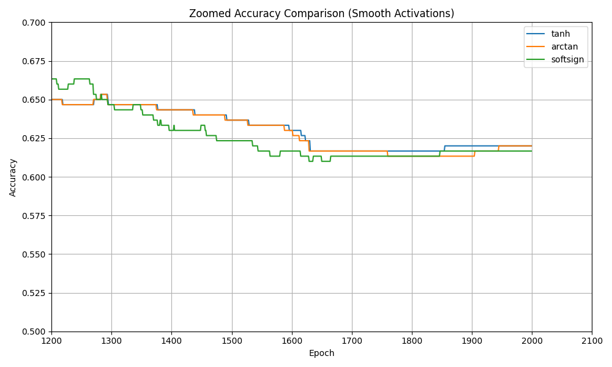

# Activation Gradient Flow in Deep Neural Networks

This project investigates how different activation functions influence **gradient flow, optimization dynamics, and convergence behavior** in deep neural networks. Rather than focusing solely on final accuracy, the emphasis is on *how* networks learn under different activations when all other factors are held constant.

---

## Motivation

Activation functions are often chosen by convention—ReLU by default—without close examination of how they affect gradient propagation and training efficiency. While smooth bounded activations such as `tanh`, `arctan`, and `softsign` are sometimes proposed as alternatives, their practical impact on optimization dynamics in deep networks is not always clear.

This project aims to empirically analyze these effects by isolating the role of the activation function and directly measuring gradient behavior during training.

---

## Methodology

We perform a controlled activation ablation study using a fully connected multilayer perceptron implemented **from scratch**.

**Task**
- Binary classification on a nonlinear XOR dataset

**Model**
- Deep fully connected MLP
- Identical architecture across all runs
- Identical random initialization seeds

**Training**
- Binary cross-entropy loss
- Gradient descent optimization
- Fixed learning rate and training duration

**Activations tested**
- ReLU  
- tanh  
- arctan  
- softsign  

The **only variable changed** between experiments is the hidden-layer activation function.

During training, we log:
- Accuracy vs epoch
- Per-layer gradient norms
- Saturation or dead-unit rates

This setup allows us to study optimization behavior independently of representational capacity.

---

## Results

### Accuracy Comparison

ReLU converges significantly faster and achieves substantially higher final accuracy than all smooth bounded activations.



---

### Zoomed View: Smooth Activations

A zoomed analysis of smooth activations (`tanh`, `arctan`, `softsign`) reveals that while these functions eventually converge to similar accuracy, they exhibit noticeably slower and less stable optimization dynamics.



Notably, `tanh` and `arctan` converge to nearly identical final accuracy, indicating comparable representational capacity. However, `arctan` consistently lags in convergence speed, reflecting weaker gradient flow despite reaching the same solution basin.

---

## Key Takeaways

- **Activation choice strongly affects optimization efficiency**, not just final accuracy.
- Smooth bounded activations can eventually solve the task, but require substantially more training due to gradient attenuation.
- ReLU performs best in this setting by enabling stronger gradient propagation and faster convergence.
- Final accuracy alone is insufficient to characterize training quality in deep networks.

---

## Reproducibility

To run the experiments and generate plots:

```bash
python src/train.py
python src/plot_results.py
python src/plot_zoomed.py
